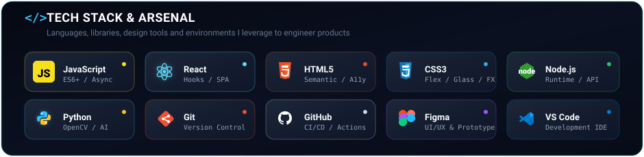
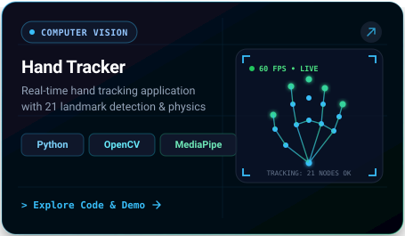
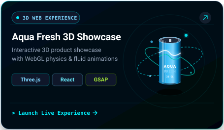
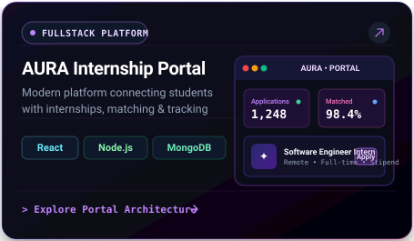

  <!-- ================= HERO SECTION ================= -->
  

    

  <!-- ================= TECH STACK SECTION ================= -->
  

    

<!-- ================= FEATURED PROJECTS ================= -->

  <h2>📁 Featured Projects</h2>
  
<em>Curated collection of interactive 3D web applications, computer vision tools, and platforms</em>

  
  &nbsp;
  

  
  &nbsp;
  

 

<!-- ================= GITHUB STATS & ACTIVITY ================= -->

  <h2>⚡ GitHub Activity &amp; Analytics</h2>

  
  &nbsp;
  

  

 

<!-- ================= CONNECT SECTION ================= -->

  <h2>🌐 Let's Connect</h2>
  
<em>Feel free to reach out for collaborations, project inquiries, or creative discussions!</em>

  

    
    &nbsp;
    
    &nbsp;
    
    &nbsp;
    
  

 

<!-- ================= FOOTER ================= -->

  

